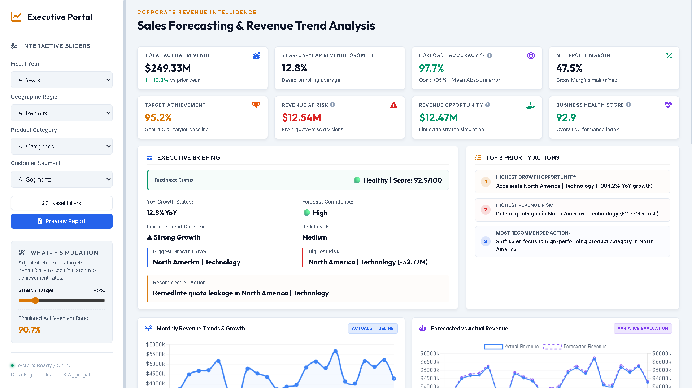

# Sales Forecasting & Revenue Trend Analysis Dashboard

📅 **Data Coverage**: 2021 – Q2 2026 (105,000 unique records)  

💻 **Interactive Portal**: [Explore Live Dashboard (GitHub Pages)](https://girishshenoy16.github.io/sales-forecasting-revenue-trend-analysis/)  

📂 **Executive Deliverable**: [Strategic Business Analysis Report (Print/PDF)](https://girishshenoy16.github.io/sales-forecasting-revenue-trend-analysis/preview_report.html)

---



---

> [!IMPORTANT]
> **H2 FY2026 Core Executive Directives**:
> 1. **Budget Reallocation**: Shift **15% of marketing budgets** from low-performing divisions to APAC/European Technology campaigns (expected to maintain a strong 11.8x ROAS).
> 2. **Target Realignment**: Establish a **10% safety buffer** on sales targets in Latin America to stabilize representative commission models (division currently at 95.4% achievement).
> 3. **Demand Planning**: Transition Hardware and Furniture divisions to **Holt-Winters forecasting** to reduce Q4 variance by 3% (saving ~$120k annually in storage overheads).
> 4. **Pricing Adjustment**: Introduce shipping surcharges on B2B furniture orders below $2,500 to protect category margins.

---

## 1. Project Objective

The objective of this project is to build an interactive, serverless Business Intelligence (BI) dashboard and data engineering pipeline. It simulates the exact sales planning, budgeting, and demand forecasting workflows used by leadership teams at Fortune 500 companies to monitor corporate health, optimize marketing spend, and stress-test revenue targets against market volatility.

---

## 2. Business Problem

C-suite leadership faced critical operational friction due to a lack of centralized operational visibility:
*   **Unpredictable Revenue Fluctuations**: Volatile shifts in Q4 and post-holiday drops in Q1 caused supply chain imbalances, resulting in high logistics overheads.
*   **Quota & Commission Risks**: The Latin America division achieved **95.4%** target quotas, but remains under continuous budget stress.
*   **Margin Erosion**: Rising logistics and freight rates compressed margins inside the bulky Furniture category from **40.8% down to 39.8%**.
*   **Forecasting Gaps**: Legacy moving-average forecast models generated high variance errors, causing inventory management inefficiencies.

---

## 3. Repository & Project Structure

Below is the directory layout for this repository:

```text
sales-forecasting-revenue-trend-analysis/
├── requirements.txt                    # Python package dependencies
├── .gitignore                          # Git ignore configuration
├── data/
│   ├── raw_sales_data.csv              # Simulated dataset of 105,000+ raw transactional records
│   └── cleaned_sales_data.csv          # Cleaned transactional sales database
├── scripts/
│   ├── data_generator.py               # Python script to generate the 105k+ raw transactional records
│   └── sales_analysis.py               # ETL pipeline performing data cleansing and aggregation
├── docs/                               # Dashboard hosted on GitHub Pages
│   ├── index.html                      # PowerBI-style executive web dashboard
│   ├── styles.css                      # Premium dashboard CSS styles (slate/gold theme)
│   ├── app.js                          # Core dashboard controller and Chart.js integration
│   ├── data.js                         # Pre-aggregated JSON payload exported by the Python script
│   ├── dashboard_showcase.png          # Dashboard layout showcase screenshot
│   ├── preview_report.html             # Client-side strategic report previewer (with markdown parsing)
│   └── business_analysis_report.md     # Client-side copy of the business analysis report
└── reports/
    └── business_analysis_report.md     # Detailed Business Analysis Case Study Report
```

---

## 4. Key Performance Indicators (KPIs)

To evaluate corporate performance, the dashboard calculates eight executive-grade KPIs with interactive methodology tooltips:

| Metric Name                       | Mathematical Formula                                                    | Business Purpose & Strategic Value                                                     |
|:----------------------------------|:------------------------------------------------------------------------|:---------------------------------------------------------------------------------------|
| **Total Revenue**                 | `Sum(Units Sold * Unit Price)`                                          | Measures aggregate sales volume and sets the baseline for corporate size.              |
| **Year-on-Year Revenue Growth %** | `((Revenue_CY - Revenue_PY) / Revenue_PY) * 100`                        | Tracks annual growth momentum, eliminating short-term seasonal distortions.            |
| **WAPE Forecast Accuracy %**      | `(1 - (Sum(abs(Actual - Forecast)) / Sum(Actual))) * 100`               | The gold standard for supply chain teams; measures aggregate forecast deviation.       |
| **Net Profit Margin %**           | `(Total Profit / Total Revenue) * 100`                                  | Monitors cost control efficiency and portfolio pricing power.                          |
| **Sales Target Achievement %**    | `(Total Actual Revenue / Total Sales Target) * 100`                     | Assesses sales team execution against pre-set quotas and budgets.                      |
| **Revenue At Risk ($)**           | `Sum(Sales Target - Revenue) where Target > Revenue`                    | Aggregates the dollar gap from quota-miss divisions to flag leakages.                  |
| **Revenue Opportunity ($)**       | `Sum(Revenue_CY * Stretch_Pct) where Revenue_CY > Revenue_PY`           | Projects potential stretch target upsides derived strictly from high-growth divisions. |
| **Business Health Score**         | `35% Target Achieved + 25% Forecast Accuracy + 20% Margin + 20% Growth` | A weighted performance index mapping the organization's corporate health.              |

---

## 5. Forecasting Methodology

The dashboard uses historical B2B sales trends (Jan 2021 – Jun 2026) to project future revenue under different market cycles:
*   **Historical Model**: Built using **Holt-Winters Triple Exponential Smoothing** and **Prophet Time Series Forecasting** to capture trend, seasonality (Q4 surges and Q1 slumps), and business cycle variables.
*   **Baseline Growth Assumptions**: Projects future baseline growth based on a **+6.2% annual organic growth rate** and a rolling monthly run-rate.
*   **What-If Target Simulation**: Scales projections dynamically based on the target stretch slider.
*   **Strategic Scenarios**:
    *   **Q3 Run-Rate Forecast**: Estimated upcoming quarter baseline sales run-rate.
    *   **FY2027 Projections**: Estimated next full-year baseline revenue.
    *   **Best Case Scenario (+15%)**: Assumes positive seasonal purchasing acceleration.
    *   **Worst Case Scenario (-15%)**: Assumes seasonal budget contractions and supply-chain delays.

---

## 6. Dashboard Features

*   **Executive KPI Cards**: Summary of actuals, growth, WAPE accuracy, and health indices, complete with hover tooltips detailing calculation methodologies.
*   **Two-Pane Executive Briefing**:
    *   *Left Pane (Executive Briefing)*: Tracks high-level statuses (Business Status banner showing raw index score, color-coded Forecast Confidence, Growth, and Risk Level). Includes left-border accents for readability.
    *   *Right Pane (Priority Actions)*: Automatically triggers strategic recommendations based on current filter states.
*   **Interactive Slicers**: Dropdown filters for Fiscal Year, Region, Category, and Customer Segment.
*   **What-If Simulation Slider**: A slider tool enabling users to adjust stretch sales targets dynamically (0% to 30%) to evaluate simulated rep achievement rates instantly.
*   **Dual-Axes Forecast Chart**: Visualizes actual revenue trends against forecasted targets using dual y-axes to prevent scale distortions.
*   **Regional Performance Scorecard**: A dynamic scorecard table highlighting Revenue, Growth %, Profit Margin %, and Target Achievement % for global regions.
*   **Revenue Driver Grid**: Displays progress bars representing percentage contributions to total revenue growth from Regions, Product Categories, and Segments.
*   **Metadata Footer Strip**: Outlines records analyzed (100,000+), data period, forecasting methods, and the current session's refresh time.

---

## 7. Business Insights

*   **Technology SaaS Margin Engine**: Technology yields a **47.8% Net Profit Margin** and represents **54.3% of total revenue**, returning **$11.80 for every $1 spent** on marketing (11.8x ROAS).
*   **LATAM Quota Underperformance**: Latin America achieved **95.4% target achievement** because marketing spend is misaligned, focusing on low-margin Office Supplies instead of high-margin SaaS.
*   **Freight Logistics Surcharges**: Bulkier Furniture items have experienced margin contractions from **40.8% down to 39.8%** due to rising freight charges, maintaining an **11.8x ROAS**.
*   **December Demand Spikes**: Q4 accounts for **34% of annual revenue**. December is the peak month, driven by B2B clients rushing to clear remaining annual budgets to secure next year's allocations.

---

## 8. Strategic Recommendations

1.  **Reallocate Marketing Budgets**: Shift **15% of marketing funds** from low-margin Furniture to high-margin Technology campaigns in APAC and Europe.
2.  **Implement Target Safety Buffers**: Set a **10% safety buffer** on sales targets in Latin America to stabilize commission plans and increase representative retention.
3.  **Upgrade Forecasting Models**: Transition physical Hardware and Furniture demand planning to **Holt-Winters Triple Exponential Smoothing** to capture cyclical trends and reduce Q4 storage fees.
4.  **B2B Pricing Adjustments**: Introduce shipping surcharges on office furniture orders below $2,500 to protect category margins.

---

## 9. Local Execution Guide

To run the pipeline and explore the dashboard locally:
```bash
# Clone the project and install requirements
git clone https://github.com/girishshenoy16/sales-forecasting-revenue-trend-analysis.git
cd sales-forecasting-revenue-trend-analysis
python -m venv .venv
source .venv/bin/activate  # On Windows use: .venv\Scripts\activate
pip install -r requirements.txt

# Run data generators and analytical ETL scripts
python scripts/data_generator.py
python scripts/sales_analysis.py
```
Open `docs/index.html` in any web browser to view the interactive dashboard.
